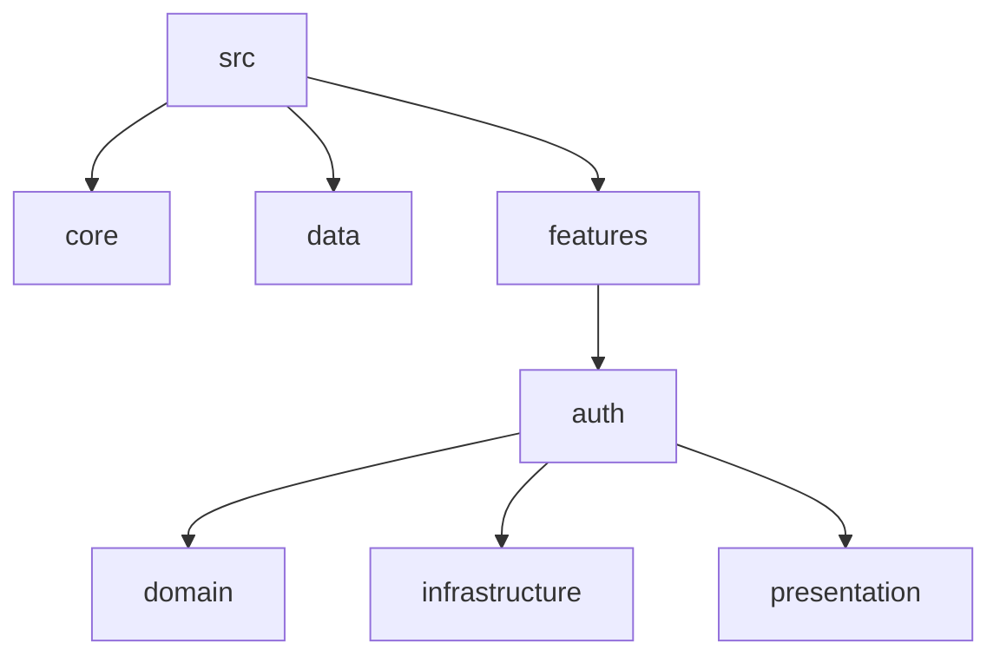
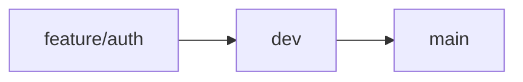
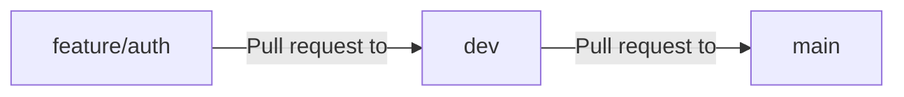

# Guía de contribución

Este documento es una guía para contribuir al repositorio de Back-Jewelry. Incluye información sobre la pila tecnológica, desarrollo local, entornos, distribución de ramas, nomenclatura de ramas, contribución de PR y despliegue.

## Pila tecnológica

Actualmente, estamos usando Node.js, Express y TypeScript. La razón principal de esto es que estamos buscando una base de código escalable y mantenible.

## Desarrollo local

### Estructura del proyecto

Usamos arquitectura limpia para organizar la base de código. La idea principal es separar el código en capas, haciendo que sea más fácil de mantener y probar. El proyecto está dividido en las siguientes carpetas:



### Entornos

Principalmente usamos un archivo .env para el repositorio. Este archivo contiene las variables de entorno para los entornos de desarrollo, prueba y producción. El archivo se encuentra en la raíz del proyecto.

```env
PORT=3000
```

## Distribución de ramas

Todo el código sigue una dirección de flujo, las ramas de tareas se fusionan en dev, luego se promueve a la rama main.

Cuando estás creando una nueva tarea, debes extender desde la rama dev, y no desde main.



## Nomenclatura de ramas

Todas las ramas contienen la siguiente sintaxis para describir el propósito de la contribución. Aunque no es necesario, nos ayuda a entender qué cambios están por venir, por lo tanto, deberías adherirte a esto cada vez que crees un PR.

Por favor, sigue esta convención:

```
feature/auth
feature/createProduct
```

## Contribución de PR

El nuevo código o PR que se va a fusionar debe seguir esta dirección



```
Title: Feature: Added Auth module
Description: empty or if you want could add something that help us to clarify some point
```

```

```
